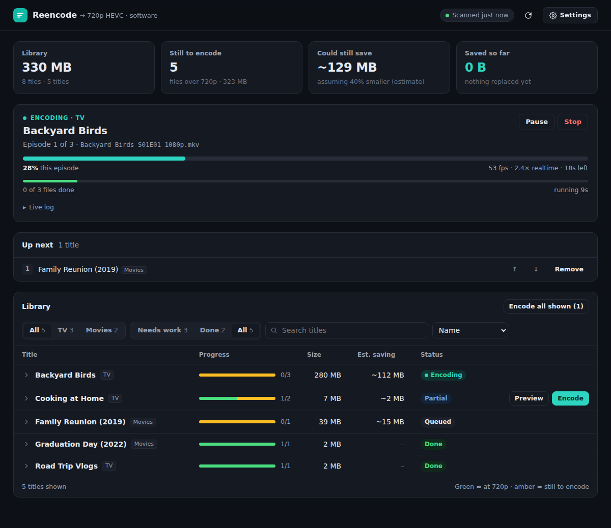

# Reencode

Shrink your video library by re-encoding it to 720p HEVC on your GPU, and manage it all from a web dashboard.

A 1080p or 4K file often comes out **less than half the size** and still looks great on most screens. Your originals are only replaced once the new file has been checked, so nothing is lost if something goes wrong.



## Features

- **Web dashboard**: see your whole library, what's left to shrink, and how much space you'll save
- **One click** to encode a show or movie, or everything at once, with a queue you can reorder
- **Live progress**: speed, time left, and a live log
- **Pause, resume or stop** at any time
- **Encoding hours** (e.g. overnight only), so it stays out of the way while you're watching
- **TV shows, movies, home videos**: any folder of videos
- **Safe by design**: every file is checked before it replaces the original
- **Hardware encoding**: AMD, Intel and NVIDIA GPUs, or plain CPU

## Quick start (Docker)

1. Save [`docker-compose.yml`](docker-compose.yml) and change the paths to your folders.
2. Start it:

   ```bash
   docker compose up -d
   ```

3. Get the generated password:

   ```bash
   docker logs reencode
   ```

4. Open `http://<your-server>:8686` and sign in (any username).

### Using Cosmos, Portainer, Unraid or similar

Paste the compose file into their "import compose" or stack screen, or create the container by hand:

| Setting  | Value |
|----------|-------|
| Image    | `ghcr.io/birdtruther/reencode:latest` |
| Port     | `8686` |
| Device   | `/dev/dri` (AMD/Intel GPU) |
| `PUID` / `PGID` | The user/group that owns your videos (run `id` to find them) |
| `TZ`     | Your timezone, e.g. `America/New_York` |
| `/config`    | Settings, history and logs (keep this) |
| `/transcode` | Scratch space for encodes (an SSD is ideal) |
| `/media/...` | Your libraries, e.g. `/media/TV` and `/media/Movies` |

If your tool has a reverse proxy (Cosmos does), point a URL at port 8686 and let it handle HTTPS.

## Organizing your library

Point Reencode at one or more **library folders**. Each show or movie should be in its own folder inside:

```
/media/TV/Backyard Birds/Season 1/Backyard Birds S01E01 1080p.mkv
/media/Movies/Family Reunion (2019)/Family Reunion (2019) 2160p.mp4
```

This is the same layout Plex and Jellyfin use. Videos sitting loose in the library folder itself are skipped.

## Settings

Change these in the dashboard under **Settings**, or edit `reencode.conf` (created on first run).

| Setting | Default | What it does |
|---------|---------|--------------|
| Libraries | auto-detected | Folders that contain your show/movie folders |
| Target resolution | `720` | Anything taller gets scaled down to this |
| Encoder | `vaapi` | `vaapi` (AMD/Intel), `nvenc` (NVIDIA) or `software` (CPU, slow) |
| Quality | `32` | Lower = better quality, bigger files. Try 28–32 for `vaapi`, 24–28 for the others |
| GPU decoding | `auto` | Also decode on the GPU (faster). Falls back to the CPU for files the GPU can't read |
| Encoding hours | any time | e.g. `01:00-08:00`. Outside these hours encodes pause and resume later |
| Temp folder | `/tmp/reencode` (`/transcode` in Docker) | Where new files are written before they replace the originals |

**Which GPUs work?** AMD Radeon RX 400 series and newer, Intel 6th generation (Skylake) and newer, and NVIDIA GTX 950 and newer.

## Security

- **A password is on by default.** One is generated on first run, printed in the logs, and saved as `.dashboard_password` in the config folder. To choose your own, set `REENCODE_DASHBOARD_PASSWORD`.
- **Wrong guesses are blocked.** After 10 wrong passwords, that address is locked out for 10 minutes.
- **Reaching it from outside your home:** don't just open port 8686 on your router. Use a VPN like [Tailscale](https://tailscale.com), or a reverse proxy with HTTPS (Cosmos, Caddy, Nginx Proxy Manager, …).
- **Proxy with its own login:** if you've turned that on and removed the port mapping, you can set `REENCODE_DASHBOARD_NO_PASSWORD=1` to avoid logging in twice.

## How your files are kept safe

1. Each video is encoded to a temporary file first.
2. The new file is checked: right resolution and the same length as the original.
3. Only when **every** episode of a show has passed is anything replaced. The new file is copied into place before the original is deleted.
4. If the new file isn't smaller, the original is kept.

Stopping, pausing, a crash or a full disk never replaces a good file with a broken one. All audio tracks and subtitles are kept, and subtitle files next to the video are renamed to match.

## Other ways to run it

<details>
<summary><b>As a system service (without Docker)</b></summary>

Needs `ffmpeg` and `python3` (3.8+). There are no other dependencies.

```bash
git clone https://github.com/BirdTruther/reencode
cd reencode
sudo ./install-service.sh      # starts now and on every boot, prints the address and password
```

Options: `--port 9000`, `--user someone`, `--uninstall`.
</details>

<details>
<summary><b>Run the dashboard by hand</b></summary>

```bash
./dashboard.py                        # Ctrl+C to stop
./dashboard.py --host 127.0.0.1       # only reachable from this machine (no password needed)
./dashboard.py --tls-cert cert.pem --tls-key key.pem   # built-in HTTPS
```
</details>

<details>
<summary><b>Command line only</b></summary>

```bash
./encodetv                                 # pick a title from a menu
./reencode.sh --all                        # everything in every library
./reencode.sh --show "Backyard Birds"      # one show or movie
./reencode.sh --dry-run --show "Backyard Birds"   # preview only, changes nothing
./reencode.sh --help                       # all options
```
</details>

<details>
<summary><b>Build the Docker image yourself</b></summary>

Clone the repo and replace the `image:` line in `docker-compose.yml` with `build: .`, then run `docker compose up -d --build`.
</details>

## Troubleshooting

**Encodes fail straight away on a GPU.** Check that your GPU supports HEVC encoding: run `vainfo` (or `docker exec reencode vainfo`) and look for `VAProfileHEVCMain : VAEntrypointEncSlice`.
- AMD needs `mesa-va-drivers`.
- Intel needs `intel-media-va-driver`.
- The Docker image already includes both.

**"Permission denied" on `/dev/dri`.** Without Docker, add your user to the `video` and `render` groups (`sudo usermod -aG video,render $USER`), then log out and back in. With Docker, check that `/dev/dri` is passed to the container.

**Something else failed.** Open **Recent jobs** in the dashboard and click **Log**. Full details for each file are in the `logs` folder.

**NVIDIA with Docker.** Install the NVIDIA Container Toolkit, use the commented `deploy:` section in `docker-compose.yml` instead of `/dev/dri`, and set the encoder to `nvenc`.

## License

[GPL-3.0](LICENSE). You're free to use, change and share Reencode. If you distribute a modified version, share its source under the same license.
